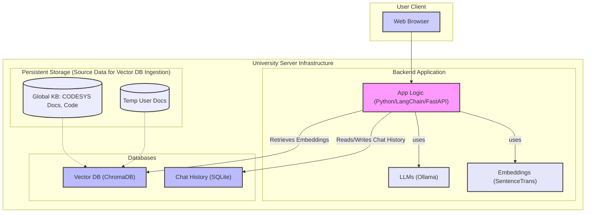
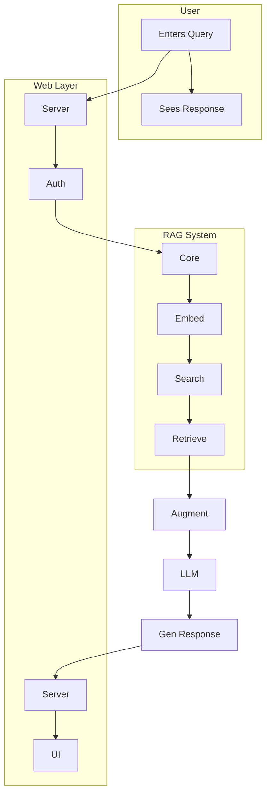
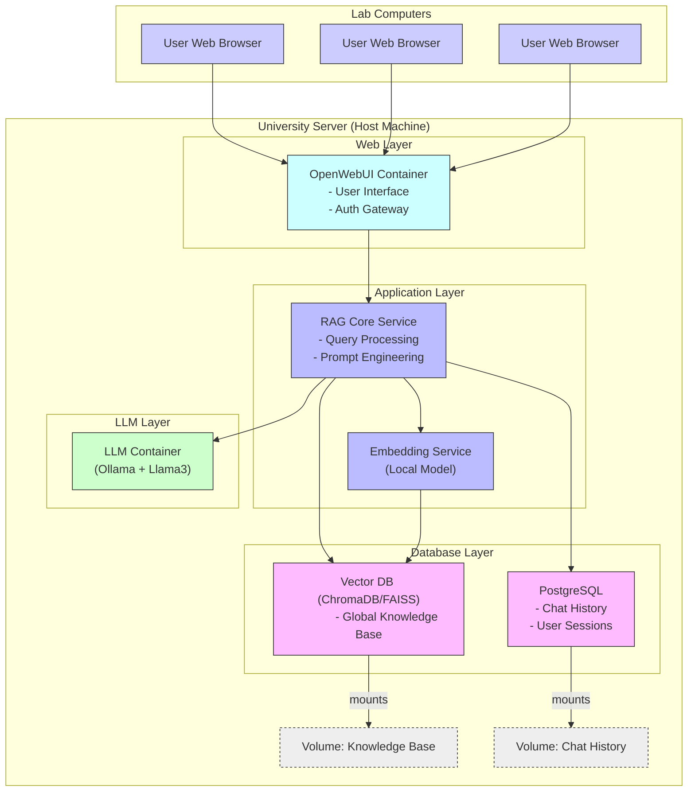
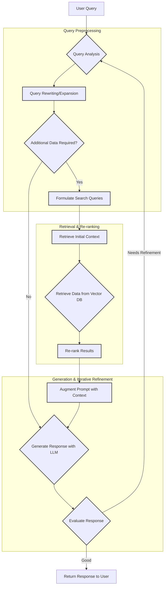
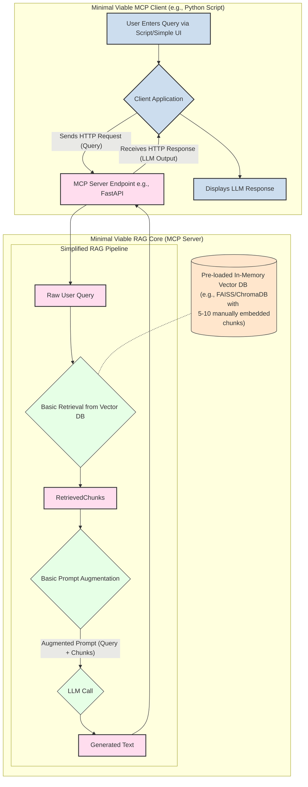

```markdown
# RAG System Architecture and Data Flow

This document provides a comprehensive overview of the architecture and data flow for the Retrieval-Augmented Generation (RAG) system. The diagrams illustrate the various components and their interactions within the system.

## 1. System Architecture Overview



### 2. Data Flow Diagram - Main RAG Query Processing



### 3. Deployment Diagram (Docker Focus)



### 4. Advanced RAG Retrieval Strategy



### 5. Phase 1 Prototype: Minimal Viable RAG Flow


