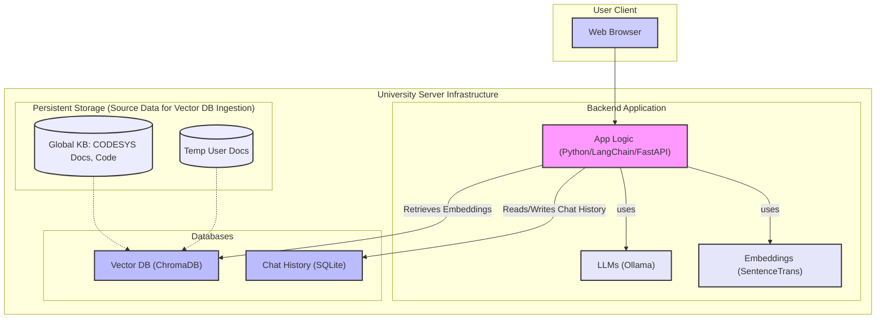
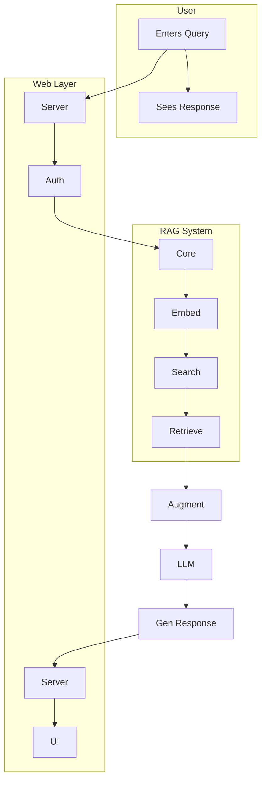
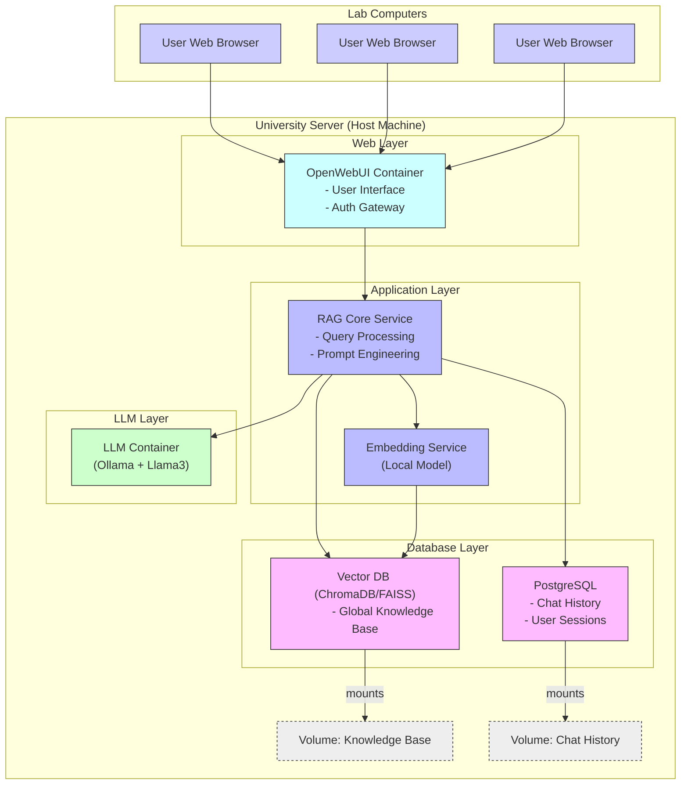

```mermaid
graph TD
    subgraph "User Client"
        Client[Web Browser]
    end

    subgraph "University Server Infrastructure"
        direction TB

        subgraph "Backend Application"
            AppServer["App Logic (Python/LangChain/FastAPI)"]
            AppServer -- "uses" --> LLMTool["LLMs (Ollama)"]
            AppServer -- "uses" --> EmbeddingTool["Embeddings (SentenceTrans)"]
        end
        
        subgraph "Databases"
            VectorDB["Vector DB (ChromaDB)"]
            ChatHistoryDB["Chat History (SQLite)"]
        end

        subgraph "Persistent Storage (Source Data for Vector DB Ingestion)"
            GlobalKB[("Global KB: CODESYS Docs, Code")]
            TempDocs[("Temp User Docs")]
        end
    end

    Client --> AppServer

    AppServer -- "Retrieves Embeddings" --> VectorDB
    AppServer -- "Reads/Writes Chat History" --> ChatHistoryDB
    
    %% VectorDB ingestion flow (conceptual, not real-time query path)
    GlobalKB -.-> VectorDB
    TempDocs -.-> VectorDB

    classDef client fill:#ccf,stroke:#333,stroke-width:2px;
    classDef backendApp fill:#f9f,stroke:#333,stroke-width:2px;
    classDef tool fill:#e6e6fa,stroke:#333,stroke-width:2px;
    classDef database fill:#bbf,stroke:#333,stroke-width:2px;
    classDef storage fill:#lightgrey,stroke:#333,stroke-width:2px;

    class Client client;
    class AppServer backendApp;
    class LLMTool,EmbeddingTool tool;
    class VectorDB,ChatHistoryDB database;
    class GlobalKB,TempDocs storage;
```

### 2. Data Flow Diagram - Main RAG Query Processing

```mermaid
graph TD
    subgraph "User"
    A[Enters Query] --> M[Sees Response]
    end
    
    subgraph "Web Layer"
    B[Server] --> C[Auth]
    K[Server] --> L[UI]
    end
    
    subgraph "RAG System"
    D[Core] --> E[Embed]
    E --> F[Search]
    F --> G[Retrieve]
    end
    
    A --> B
    C --> D
    G --> H[Augment]
    H --> I[LLM]
    I --> J[Gen Response]
    J --> K
```

### 3. Deployment Diagram (Docker Focus)

```mermaid
graph TD
    subgraph "Lab Computers"
        User1["User Web Browser"]
        User2["User Web Browser"]
        UserN["User Web Browser"]
    end

    subgraph "University Server (Host Machine)"
        direction TB
        
        subgraph "Web Layer"
            OpenWebUI["OpenWebUI Container
            - User Interface
            - Auth Gateway"]
        end

        subgraph "Application Layer"
            RAGCore["RAG Core Service
            - Query Processing
            - Prompt Engineering"]
            
            EmbeddingService["Embedding Service
            (Local Model)"]
        end

        subgraph "Database Layer"
            VectorDB["Vector DB (ChromaDB/FAISS)
            - Global Knowledge Base"]
            
            PostgresDB["PostgreSQL
            - Chat History
            - User Sessions"]
        end

        subgraph "LLM Layer"
            LocalLLM["LLM Container
            (Ollama + Llama3)"]
        end

        VolumeKB["Volume: Knowledge Base"]
        VolumeChat["Volume: Chat History"]
    end

    %% Connections
    User1 --> OpenWebUI
    User2 --> OpenWebUI
    UserN --> OpenWebUI

    OpenWebUI --> RAGCore
    RAGCore --> EmbeddingService
    RAGCore --> VectorDB
    RAGCore --> PostgresDB
    RAGCore --> LocalLLM

    EmbeddingService --> VectorDB
    VectorDB -- "mounts" --> VolumeKB
    PostgresDB -- "mounts" --> VolumeChat

    classDef user fill:#ccf,stroke:#333
    classDef web fill:#cff,stroke:#333
    classDef app fill:#bbf,stroke:#333
    classDef db fill:#fbf,stroke:#333
    classDef llm fill:#cfc,stroke:#333
    classDef volume fill:#eee,stroke-dasharray:3 3,stroke:#333

    class User1,User2,UserN user
    class OpenWebUI web
    class RAGCore,EmbeddingService app
    class VectorDB,PostgresDB db
    class LocalLLM llm
    class VolumeKB,VolumeChat volume
```
